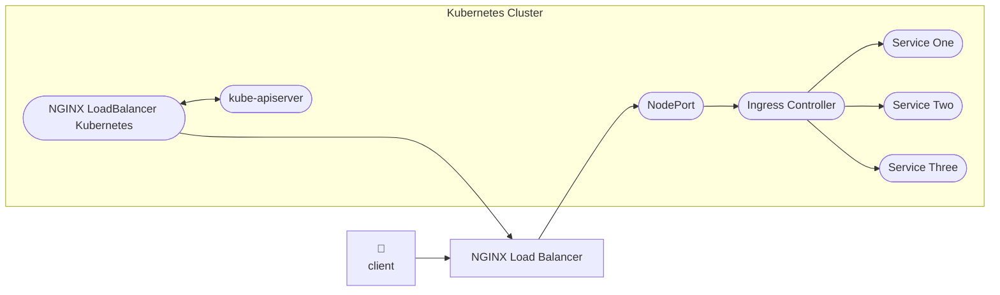
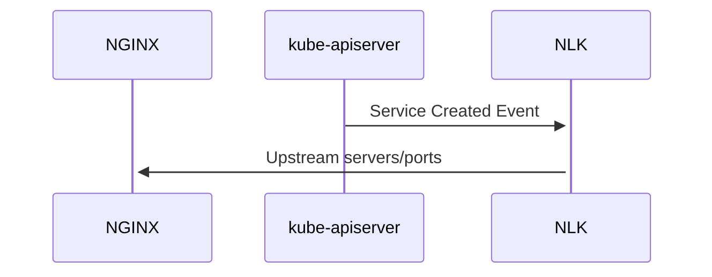

# Demo Script

## Introduction

NGINX Loadbalancer for Kubernetes (NLK) aims to take the place of cloud-provider specific Loadbalancers such as AWS' Application Load Balancer or the Azure's Azure Load Balancer in an on-premise setting. Generally when you create a `Service` of type `LoadBalancer` you'll get one of these cloud load balancers provisioned for you:

```yaml
apiVersion: v1
kind: Service
metadata:
  name: public-svc
spec:
  type: LoadBalancer
  ports:
  - port: 80
  selector:
    app: public-app
```

This provides external access to your Kubernetes cluster. A very simple version of the usual setup looks like this:


When you are not operating in a public cloud context creating a `LoadBalancer` type service doesn't automatically enable access from outside into your cluster via a public IP.  NGINX Loadbalancer for Kubernetes (NLK) aims to solve this issue by providing relevant information about the cluster ingress to an external NGINX instance acting as the Load Balancer.

> NLK is a Kubernetes controller that monitors Services and Nodes in your cluster, and then sends API calls to an external NGINX Plus server to manage NGINX Plus Upstream servers automatically.

Using the above diagram as a reference, the configuration of components looks like this with NLK:



This allows automatic syncing of relevant cluster details to the NGINX instance running outside th cluster. Because you have a normal NGINX instance acting as the load balancer, you can do anything that you would normally do with NGINX.

## Use Cases
Primarily the use case is automatic configuration of routing to `NodePort` or `LoadBalancer` services in any Kubernetes cluster using an external NGINX Plus instance.

* Multicluster loadbalancing
* SSL Termination
* Rate limiting
* Modification of requests
* Blocking suspicious traffic using NGINX -compatible Web application firewalls like NGINX App Protect

## How it Works
### A Short NGINX Primer
NGINX uses a configuration file to understand how to route traffic for your. The two concepts you need to understand at that of an `upstream` and NGINX's proxying capabilities.

#### Upstreams
In NGINX configuration, and `upstream` is a named set of servers that are a target for a proxied request.

It looks like this:

```nginx
upstream my_upstream {
    server server1.example.com;
    server server2.example.com;
}
```
This upstream references two servers.

You can then use this upstream name to proxy traffic to the servers defined in the upstream:

```
server {
    listen 80;
    location / {
        proxy_set_header Host $host;
        proxy_pass http://my_upstream;
    }
}
```

Notice that the name `my_upstream` is used as the reference. This means that the code in our `server` block does not need to change as the servers referenced by the upsream `my_upstream` change.

But how do we manage the servers referenced by `my_upstream`?  In any modern context, it's safe to assume that these servers can or will change dynamically.

This is what NLK manages.  Here's a configuration that is more relevant to the kubernetes use case. It is referencing an ingress controller that is exposed via a `LoadBalancer` object. This means a high port has been allocated for outside traffic.

```nginx
http {
    upstream cluster_a_ingress {
        server 172.18.0.5:31462;
        server 172.18.0.7:31462;
    }

    server {
        listen 443 ssl;
        location / {
            proxy_http_version 1.1;
            proxy_set_header   "Connection" "";
            proxy_set_header Host $host;
            proxy_pass https://cluster_a_ingress;
        }
    }
}
```

If you have NGINX Loadbalancer for Kubernetes installed in your cluster, to make sure that the servers in the upstream stay up to date with the access point to your ingress controller, you need only specify this configuration:

```yaml
apiVersion: v1
kind: Service
metadata:
  name: nginx-ingress
  namespace: nginx-ingress
  annotations:
    nginxinc.io/nlk-cluster_a_ingress: "http"   # switch between TCP and HTTP load balancing
spec:
  type: LoadBalancer
  externalIPs:
  - 172.19.0.6 
  ports:
  - port: 443
    targetPort: 443
    protocol: TCP
    name: nlk-cluster_a_ingress     # Must match Nginx upstream name
  selector:
    app: nginx-ingress

```

The specific items to notice here are:
* The `metadata.annotations` key contains `nginxinc.io/nlk-` followed by the same `upstream` name from the nginx configuration
* The `spec.selector`  references a label that is assigned to the NGINX Ingress Controller
* The `spec.ports[0].name` item has the string `nlk-` followed by the same `upstream` name from the nginx configuration

This allows NLK to automatically update the `cluster_a_ingress` `upstream` whenever a `Service` with the correct annotation is created or updated.

## How it works

How NLK works is conceptually simple. NLK exists as a pod in your Kubernetes cluster. It listens for `Service` create and update events. It takes the address and port information and feeds it to an NGINX Plus instance outside the cluster. 
NGINX Loadbalancer for Kubernetes


## Demonstration: Changes in Service
The easiest way to see the basics is to do the following:
1. Check the kubernetes nodeport associated with the ingress controller:
        ```bash
        $ kubectl get svc nginx-ingress -n nginx-ingress
        NAME            TYPE       CLUSTER-IP    EXTERNAL-IP   PORT(S)         AGE
        nginx-ingress   NodePort   10.96.46.68   <none>        443:31462/TCP   6h3m
        ```

        Notice the port assigned `31462`
2. Confirm the presence of these ports in the the NGINX Plus dashboard. Notice that the upstream is called `cafe`
3. Take a look at the NGINX configuration file:
        ```nginx
         upstream cafe {
            # Any upstream stats are stored in the zone memory
            # store. This is just in aid of the dashboard metrics
            zone cafe 256k;

            # advanced NGINX Loadbalancing algorithm
            least_time last_byte;
            keepalive 16;
            #servers managed by NLK Controller
            state cafe-https.state;
        }

        server {
            listen 443 ssl;
            status_zone https://cafe.example.com;
            server_name cafe.example.com;
            ssl_certificate /etc/ssl/default.crt;  # self-signed for example only
            ssl_certificate_key /etc/ssl/default.key;
            
            location / {
                status_zone https://cafe.example.com./;
                proxy_set_header Host $host;
                proxy_http_version 1.1;
                proxy_set_header   "Connection" "";
                proxy_pass https://cafe;
            }
        }
        ```

        Notice that the upstream is called `cafe` and it contains no servers explicitly defined in the configuration file.
4. Finally, look at the nodeport definition:
        ```yaml
            apiVersion: v1
            kind: Service
            metadata:
              name: nginx-ingress
              namespace: nginx-ingress
              annotations:
                # This switches between layer 7 and layer 4. This is for the nginx plus API
                nginxinc.io/nlk-cafe: "http"
            spec:
              type: NodePort
              ports:
              - port: 443
                targetPort: 443
                protocol: TCP
                name: nlk-cafe
              selector:
                app: nginx-ingress
        ```
        Again note the `metadata.annotations` value which contains `nlk-` as well as the `upstream` name from the NGINX configuration file.

        Also the `spec.ports[0].name` is `nlk-` then the same name. These should be in sync. You can track any number of ports but the name must be prefixed with `nlk-`.  This allows you do have non-NLK managed ports in the same `NodePort` definition.

        Finally note that the `spec.selector.app` value corresponds to the NGINX Ingress Controller.
5. See that performing a request to `https://cafe.example.com/coffee` in the browser routes us correctly.

Now that we understand how these are being maintained, let's delete the `NodePort`
```bash
$ kubectl delete -f nlk/nodeport.yaml
service "nginx-ingress" deleted
```

Now before we recreate the `NodePort` let's verify a few things:
1. Hitting `https://cafe.example.com/coffee` now results in a `502 bad gateway` response
2. The NGINX Plus Dashboard shows no active servers in the `cafe` upstream

Now let's add back the Service:

```bash
$ kubectl apply -f nlk/nodeport.yaml
service/nginx-ingress created
```

Performing the same checks again:
1. Hitting `https://cafe.example.com/coffee` once again renders the "coffee" page
2. The NGINX Plus Dashboard shows three servers in the `cafe` upstream

Notice that the high port the NGINX load balancer is proxying to is a **different** port.


## What Else is Interesting Here?

### Handling the NGINX Restarting

### Splitting Traffic at the Edge

### Modifying the Request Before it Hits the Cluster with NGINX Javascript