# Demo Script

## Introduction

NGINX Loadbalancer for aims to take the place of cloud-provider specific Loadbalancers such as AWS' Application Load Balancer or the Azure's Azure Load Balancer. Generally when you create a `Service` of type `LoadBalancer` you'll get one of these load balancers provisioned for you:

```yaml
apiVersion: v1
kind: Service
metadata:
  name: public-svc
spec:
  type: LoadBalancer
  ports:
  - port: 80
  selector:
    app: public-app
```

This provides external access to your Kubernetes cluster. A very simple version of the usual setup looks like this:

```mermaid
flowchart LR
    client["🧑<br/>client "]
    lb["Cloud Load Balancer"]
    nodeport(["NodePort"])
    ingress(["Ingress Controller"])
    sv1(["Service One"])
    sv2(["Service Two"])
    sv3(["Service Three"])
    client --> lb
    lb --> nodeport
    subgraph Kubernetes Cluster
    nodeport --> ingress
    ingress --> sv1
    ingress --> sv2
    ingress --> sv3
    end
```


