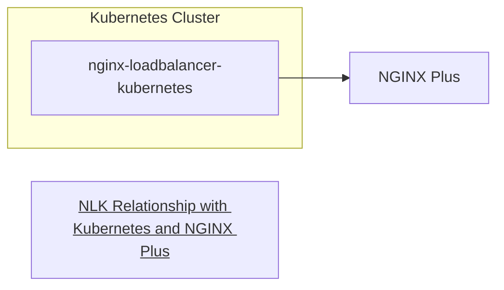

# kubecon2023
Kubecon 2023 related work

## Setup Concepts
### Goal
From the Kubernetes docs:
> Kubernetes does not directly offer a load balancing component; you must provide one, or you can integrate your Kubernetes cluster with a cloud provider.

Depending on your cloud platform, a `LoadBalancer` might create:

* AWS: Elastic Load Balancer
* Google Cloud: Google Cloud Load Balancer
* Azure: Azure Load Balancer

**TODO: what value do these provide?**

If you're not on a cloud provider and need to provide access to your cluster, what do you do?

NLK implements `LoadBalancer` for the cluser in which you install it. It then feeds information about the cluser to and NGINX instance which actually does the load balancing.

The potential benefits of this approach are? (TODO: spread of responsibility between the ingress controller and the outside load balancer)
* https://www.baeldung.com/ops/kubernetes-ingress-vs-load-balancer
* https://www.okteto.com/blog/guide-to-the-kubernetes-load-balancer-service/

 
### Pieces
This setup has three main pieces:
1. A Kubernetes cluster
    1. The NGINX Kubernetes Ingress Controller
    1. The `nginx-loadbalancer-kubernetes` controller
    1. A sample application
1. An instance of NGINX Plus running outside the Kubernetes Cluster

### Demo Implementation
1. A Kubernetes cluster -> **Kind**
    1. The NGINX Kubernetes Ingress Controller -> **installed from manifests**
    1. The `nginx-loadbalancer-kubernetes` controller -> **installed from manifests**
    1. A sample application -> **The NGINX Coffeeinstalled from manifests**
1. An instance of NGINX Plus running outside the Kubernetes Cluster -> Running in a docker container on the same docker network as the kind cluster

### 

