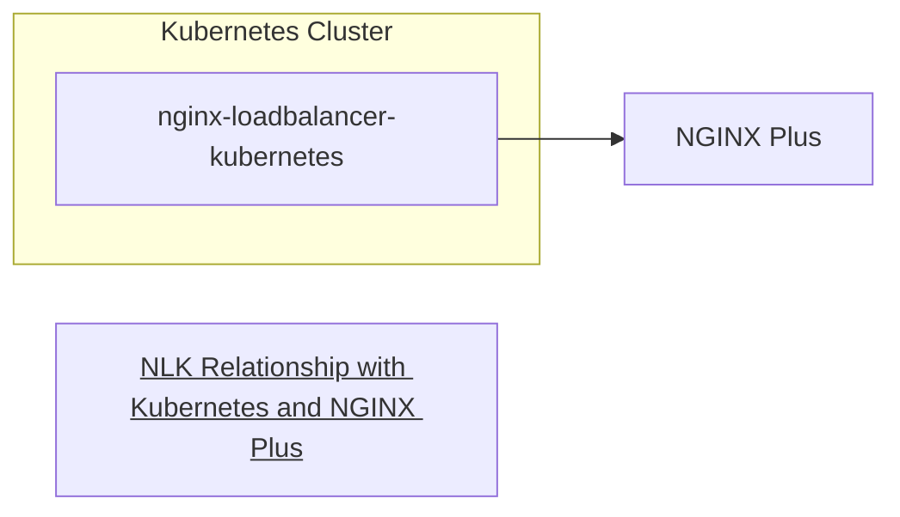

# kubecon2023
Kubecon 2023 related work

## Setup
1. Copy your NGINX Plus certificates to `/nginx-plus/etc/ssl/nginx`
You should have the files `nginx-repo.key` and `nginx-cert.key` there.

2. Install [kind](https://kind.sigs.k8s.io/docs/user/quick-start/#installation). asdf is the easiest way to get the exact version this repo is tested with:
        * Install [asdf](https://asdf-vm.com/guide/getting-started.html)
        * Install the kind plugin `asdf plugin-add kind https://github.com/reegnz/asdf-kind.git`
        * `asdf install`
        * Now you have kind!

3. To just get things up and running just run `./start.sh`

Alternately, you can reference the guides:
[commands.md](./commands.md) is a command by command setup that basically does what `start.sh` does.  It also includes some instructions for setting up nginx app protect

[DEMO.md](./DEMO.md) is a user-facing explanation of NLK and demonstration flow.

## Setup Concepts
### Goal
From the Kubernetes docs:
> Kubernetes does not directly offer a load balancing component; you must provide one, or you can integrate your Kubernetes cluster with a cloud provider.

Depending on your cloud platform, a `LoadBalancer` might create:

* AWS: Elastic Load Balancer
* Google Cloud: Google Cloud Load Balancer
* Azure: Azure Load Balancer

**TODO: what value do these provide?**

If you're not on a cloud provider and need to provide access to your cluster, what do you do?

NLK provides a controller that is deployed to a kubernetes pod and listens for changes to services in the `nginx-ingress` namespace that have names prefixed with `nlk-`

The potential benefits of this approach are? (TODO: spread of responsibility between the ingress controller and the outside load balancer)
* https://www.baeldung.com/ops/kubernetes-ingress-vs-load-balancer
* https://www.okteto.com/blog/guide-to-the-kubernetes-load-balancer-service/

 
### Pieces
This setup has three main pieces:
1. A Kubernetes cluster
    1. The NGINX Kubernetes Ingress Controller
    1. The `nginx-loadbalancer-kubernetes` controller
    1. A sample application
1. An instance of NGINX Plus running outside the Kubernetes Cluster

### Demo Implementation
1. A Kubernetes cluster -> **Kind**
    1. The NGINX Kubernetes Ingress Controller -> **installed from manifests**
    1. The `nginx-loadbalancer-kubernetes` controller -> **installed from manifests**
    1. A sample application -> **The NGINX Coffeeinstalled from manifests**
1. An instance of NGINX Plus running outside the Kubernetes Cluster -> Running in a docker container on the same docker network as the kind cluster

